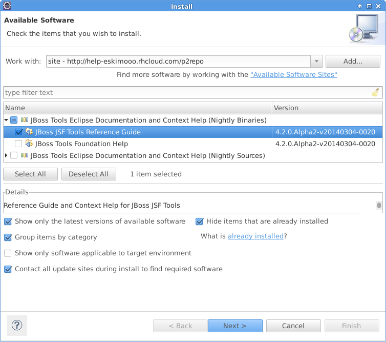

## Scenarios covered by this proof of concept

To see how context help looks like in New JSF Project wizard now open New Wizard Selection dialog.
Select JBoss Web Tools/JSF/JSF Project category (see below)

Push Next button and step into in JSF Wizard 

Select (?) button in left bottom corner to see Help Tray on right side of the dialog (see below). Currently it says: "The context help for this user element cannot be found"

This default message can be fixed by installing JBoss Tools Foumdation Help feature with default context. Next screenshot uses http://help-eskimooo.rhcloud.com/p2repo repository to install it. Follow the Install wizard instructions and restart eclipse.

Open wizard New JSF Wizard again - it is getting better (see below) now it not just has nothing. It shows description for current wizard step and possible solutions:

- Go to the external site with documentation
- Register remote JBoss Tools Documentation
- Install JBoss Tools documentation locally

In this POC first two commands in list are not implemented yet, but explained below.

Next two screanshots explains how to connect local help system to remote info-center deployed here http://help-eskimooo.rhcloud.com/help/index.jsp.

Default context also should provide command to install help feature into current eclipse and would present similar installation dialog shown below

After remote info center added or documentation feature installed context help in New JSF Wizard would look like on screenshot below

Click on topic opens documentation in the same documentation tray (see below)

=======
Scenarios covered by this proof of concept

